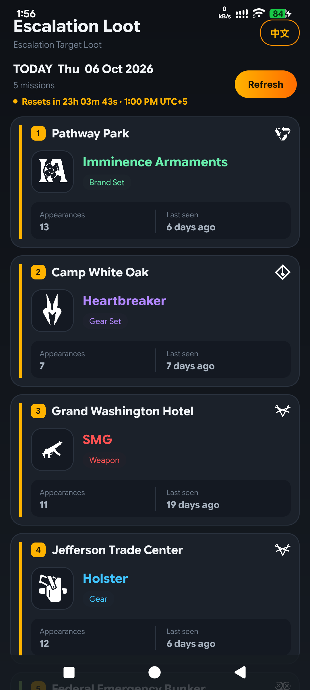
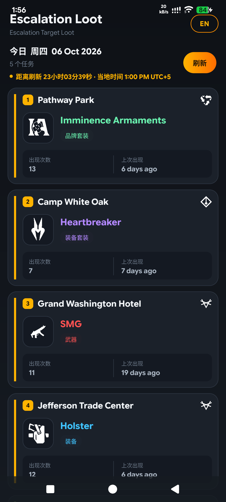

# Escalation Loot

Unofficial Android app for **The Division 2** escalation **target loot**, powered by
[prototrack.gg](https://prototrack.gg/target-loot/target-loot.php).

Shows today's five escalation targets with their gear art, and refreshes itself
daily right after the reset.

- **Android 10 → 16** (minSdk 29, targetSdk 35)
- **English / 简体中文** interface
- Refreshes automatically on open and after every daily reset
- Notification when the loot date changes
- Works out the reset time in **your** timezone, not a hardcoded one
- No account, no PC, no VPS — nothing to set up after install

## 📸 Screenshots

<div align="center">
  
  
</div>

---

## 📥 Download

Grab the APK from the **[Releases page](../../releases)** of this repo.

| | |
|---|---|
| File | `EscalationLoot.apk` |
| Size | ~12.5 MB |
| Needs | Android 10 or newer |
| Permissions | Internet + notifications. Nothing else. |
| Price | Free |

---

## ⚠️ You will see a Play Protect warning. This is expected.

**Read this before you decide it's a scam.**

When you install, Android shows something like:

> **Play Protect hasn't seen an app from this developer before, it may be unsafe.**
> *"App blocked to protect your device"*

**This is normal and it is not about this app being malicious.** Android shows
this to *every* app that is not installed from the Play Store, because Google has
never seen the developer's signing key. It is a "we don't know this developer"
notice, not a "this app is dangerous" verdict. Millions of legitimate sideloaded
apps produce it.

**To install past it:** tap **More details** (or **Install anyway**) → **Install**.

If your phone blocks the install entirely, see [If it refuses to install](#if-it-refuses-to-install).

### Why it isn't going away, and what I'm doing about it

The only thing that permanently silences this warning is being listed on the
Google Play Store, where Google recognises the certificate. That is planned,
not optional.

**What is already done:** the app is release-signed and requests the minimum it
needs — no location, no camera, no contacts, no SMS, no accessibility services,
no device admin, and zero native libraries. There is nothing in it for Play
Protect to object to. The warning is purely about the unknown signing key.

**How to tell it's genuinely this app:**

- This is the **full source code**, in this repo, MIT licensed. Read it.
- Every Release page publishes a **SHA256** of the APK. Compare it after
  downloading.
- Loot data comes from [prototrack.gg](https://prototrack.gg/target-loot/target-loot.php), and the app
  credits them inside it.

**What this app will never ask you for:** no sign-up, no login, no payment, no
personal data, no `android.permission` beyond internet and notifications.

---

## Installing

**1. Copy the APK to your phone.** Download it from Releases above, or via USB.

**2. Open it.** Tap the file in your Downloads app.

**3. Allow the install.** Android will say the app is from an unknown source.
Tap **Settings → Allow from this source**, go back, and tap **Install**.

**4. Allow the Play Protect warning.** Tap **More details** → **Install anyway**.
See [above](#️-you-will-see-a-play-protect-warning-this-is-expected) if this
freaks you out — it's normal.

**5. Grant notifications** (optional but recommended) so you get told when the
loot changes.

### If it refuses to install

| Message | What it means |
|---|---|
| "Play Protect hasn't seen an app from this developer before" | **Expected.** Tap **More details → Install anyway**. See [the warning section](#️-you-will-see-a-play-protect-warning-this-is-expected). |
| "App blocked to protect your device" (Xiaomi/MIUI) | Same root cause, more aggressive wording. On MIUI: **Settings → Passwords & security → App install → Unknown apps**, enable for your browser, then retry. |
| "App not installed" | An existing copy signed with a different key. Uninstall the old one first. |
| "Parsing error" | The file is incomplete. Re-download it and compare the SHA256 published on the Release page. |
| "Target SDK too low" / "not compatible" | Your Android is older than 10. |

### Verify what you downloaded

The SHA256 of each release is published on that release's page. To compare:

**Windows**
```powershell
Get-FileHash .\EscalationLoot.apk -Algorithm SHA256
```

**macOS / Linux**
```bash
shasum -a 256 EscalationLoot.apk
```

**Android** — install * hash checker* from the Play Store, or check the file
properties in a file manager.

### Battery optimisation — do this or the daily refresh will stop

Xiaomi, Samsung, Huawei, Oppo and OnePlus phones aggressively kill background
apps, which stops the daily refresh and the notification. If updates stop
arriving, this is almost always why:

**Settings → Apps → Escalation Loot → Battery → Unrestricted**

or **Settings → Battery → App battery saver → Escalation Loot → No restrictions**

---

## Data source

Everything comes from [prototrack.gg](https://prototrack.gg/target-loot/target-loot.php).

**No game assets are bundled in this repo or in the APK.** Every mission name,
loot name and gear image is fetched live from ProtoTrack's server when the app
runs. The app is a client of a public web page, nothing more.

Loot data is read from ProtoTrack's JSON feed, which is the same source their
Discord bot uses. The HTML page is only used to add faction icons and loot
history, and only when it reports the same date — so a stale page can never
override current data.

---

## Building from source

Requires **JDK 17** and the **Android SDK** (platform 35). Android Studio works.

```bash
git clone https://github.com/EdwardAamir/Division-2-Proto-Loot-Tracker.git
cd Division-2-Proto-Loot-Tracker
./gradlew assembleRelease
```

Output: `app/build/outputs/apk/release/`

---

## Troubleshooting

| Symptom | Cause |
|---|---|
| Loot looks like yesterday's | ProtoTrack has not updated yet. Pull to refresh. |
| "ProtoTrack is down" | ProtoTrack itself is failing, not your connection. This has happened before. |
| "No connection · showing saved data" | Your device is offline. The app is showing your last known loot. |
| Notifications stopped | Battery optimiser killed the app. See [Battery optimisation](#battery-optimisation--do-this-or-the-daily-refresh-will-stop). |
| Countdown looks wrong | Check Settings → Date & time → Time zone is set automatically. |

---

## Credits

- Loot data and gear images from [prototrack.gg](https://prototrack.gg/target-loot/target-loot.php)
- The Division 2 is a trademark of **Ubisoft Entertainment**
- Built by **edward_sukuna** — Discord

This is an unofficial fan project. It is not affiliated with or endorsed by
ProtoTrack or Ubisoft. Please respect ProtoTrack's terms of use and rate limits
if you run your own copy.

## Say hello

Found a bug, a wrong loot icon, or an idea? **Discord: `edward_sukuna`** is the
fastest way to reach me.

Please report data problems on Discord rather than opening an issue — if the loot
is wrong, it's because ProtoTrack's page said so, and they are the ones who can
fix it.

## License

[MIT](LICENSE) — see the file for the note on game content.